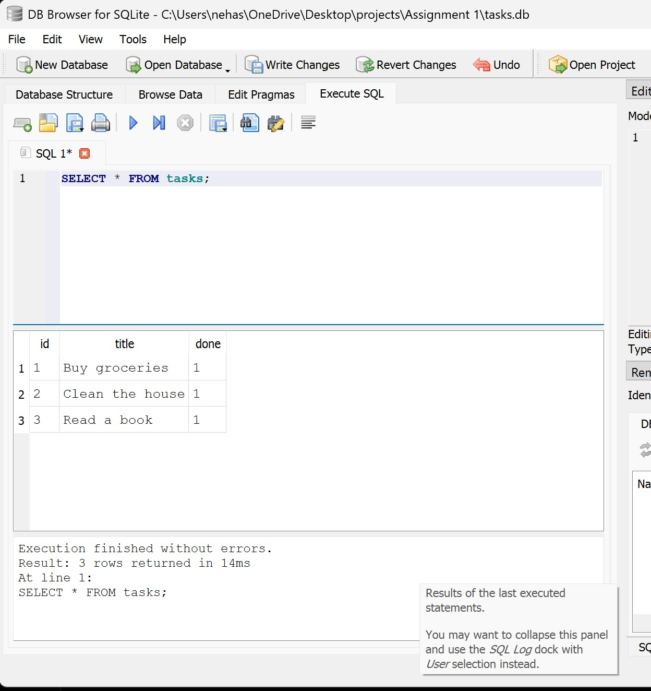

# Task API - FastAPI CRUD Application with SQLite

A beginner-friendly CRUD API built using Python 3.10+, FastAPI, and SQLite. This project implements database-backed persistence, request validation using Pydantic, custom validation error handling, and interactive API documentation.

---

## Why SQLite?
For this project, **SQLite** was chosen as the database engine because:
- **Serverless & Self-Contained**: SQLite does not require running a separate database server process. The entire database is stored in a single file (`tasks.db`).
- **Zero Configuration**: It requires no installation or setup steps, making it ideal for local development and beginner-friendly projects.
- **Built-in Support**: SQLite is supported natively by Python's built-in `sqlite3` library, eliminating the need for heavy ORM installations or external database drivers.

---

## Database Architecture & Storage

### Storage Location
The database is stored in the project's root directory as a file named **`tasks.db`**.
- **Automatic Creation**: If `tasks.db` does not exist when the application starts, it is automatically created by the system.
- **Auto-Seeding**: Upon creation, if the `tasks` table is empty, the application automatically seeds it with three initial sample tasks.
- **Git Ignore**: The local `tasks.db` file (and its temporary journal files) are listed in `.gitignore` and are intentionally not committed to the Git repository. The application dynamically handles database creation and seeding on startup, ensuring that temporary local database state does not pollute source control.

### Database Schema
The database contains a single table named `tasks` with the following column structure:

| Column | Data Type | Constraints | Description |
| :--- | :--- | :--- | :--- |
| `id` | `INTEGER` | `PRIMARY KEY AUTOINCREMENT` | Auto-generated, unique sequential task ID |
| `title` | `TEXT` | `NOT NULL` | The name/description of the task |
| `done` | `BOOLEAN` | `NOT NULL CHECK (done IN (0, 1))` | Completion status (stored as `0` for False and `1` for True) |

---

## Features
- **SQLite Database Persistence**: All task modifications survive application and server restarts.
- **Full CRUD Support**: Create, read, update, and delete tasks dynamically via SQL statements.
- **Input Validation**: Uses Pydantic models to validate input data constraints and enforce required fields.
- **Custom Error Handling**: Intercepts Pydantic validation errors to return HTTP 400 instead of HTTP 422 for malformed payloads.
- **Interactive Documentation**: Auto-generated Swagger UI for browser-based testing.

---

## Requirements
- Python 3.10 or higher
- Pip package manager

---

## Installation

1. **Clone or Download the Repository**:
   Clone or download this project folder into your workspace.

2. **Open Terminal**:
   Navigate to the project root directory.

3. **Install Dependencies**:
   Install the required Python packages using pip:
   ```bash
   pip install -r requirements.txt
   ```

---

## Running the Server

Start the development server using Uvicorn:
```bash
uvicorn main:app --reload
```

- `--reload` enables auto-reload, meaning the server will restart automatically when files are modified.
- The server will run at: **http://localhost:8000**

---

## Interactive API Documentation (Swagger UI)

FastAPI provides an out-of-the-box UI to visualize and test your API endpoints. 

Access the documentation at:
👉 **[http://localhost:8000/docs](http://localhost:8000/docs)**

---

## API Endpoints

| Method | Endpoint | Description | Success Status | Error Status |
| :--- | :--- | :--- | :--- | :--- |
| **GET** | `/` | Retrieve API metadata | `200 OK` | - |
| **GET** | `/health` | Verify server health status | `200 OK` | - |
| **GET** | `/tasks` | List all tasks | `200 OK` | - |
| **GET** | `/tasks/{id}` | Retrieve a single task by ID | `200 OK` | `404 Not Found` |
| **POST** | `/tasks` | Create a new task (auto-assign ID) | `201 Created` | `400 Bad Request` |
| **PUT** | `/tasks/{id}` | Update title and/or status of a task | `200 OK` | `400 Bad Request`, `404 Not Found` |
| **DELETE**| `/tasks/{id}` | Remove a task by ID (returns empty response) | `204 No Content` | `404 Not Found` |

---

## Manual Database Exploration

You can open and inspect the database manually using a database GUI viewer such as **DB Browser for SQLite**.

### Example SQL Query
To inspect all tasks stored in the database, write and execute the following query in your database viewer's SQL editor:
```sql
SELECT * FROM tasks;
```
* **Explanation**: This query selects and displays all columns (`id`, `title`, `done`) and all rows currently saved inside the `tasks` table. It demonstrates the live state of your database and can be used to confirm that changes made via the API are successfully persisted in SQLite.

### Database Viewer Screenshot
Below is a screenshot showing the DB Browser for SQLite interface loaded with the `tasks` database contents, displaying the three initial seeded tasks:



---

## Example Usage and Responses

### 1. Retrieve Metadata
**Request**:
```bash
curl -X GET http://localhost:8000/
```
**Response (`200 OK`)**:
```json
{
  "name": "Task API",
  "version": "1.0",
  "endpoints": ["/tasks"]
}
```

### 2. Create a Task (Valid)
**Request**:
```bash
curl -X POST http://localhost:8000/tasks \
     -H "Content-Type: application/json" \
     -d '{"title": "Buy milk"}'
```
**Response (`201 Created`)**:
```json
{
  "id": 4,
  "title": "Buy milk",
  "done": false
}
```

### 3. Create a Task (Invalid - Empty Title)
**Request**:
```bash
curl -X POST http://localhost:8000/tasks \
     -H "Content-Type: application/json" \
     -d '{"title": ""}'
```
**Response (`400 Bad Request`)**:
```json
{
  "error": "Invalid request body. Details: Field 'body -> title': Value error, Title is required and cannot be empty"
}
```

### 4. Update a Task
**Request**:
```bash
curl -X PUT http://localhost:8000/tasks/1 \
     -H "Content-Type: application/json" \
     -d '{"title": "Buy groceries and snacks", "done": true}'
```
**Response (`200 OK`)**:
```json
{
  "id": 1,
  "title": "Buy groceries and snacks",
  "done": true
}
```

### 5. Delete a Task
**Request**:
```bash
curl -X DELETE http://localhost:8000/tasks/1
```
**Response (`204 No Content`)**:
*(No response body returned)*

---

## Project Structure

```text
Assignment 1/
├── main.py             # Single-file FastAPI CRUD implementation backed by SQLite
├── requirements.txt    # Python dependencies (FastAPI, Uvicorn, Pydantic)
├── .gitignore          # Instructs Git to ignore transient files (like tasks.db, journals)
├── screenshots/        # Contains database viewer walkthrough screenshots
│   └── db_browser_view.png
└── README.md           # Getting started guide and API documentation
```

> **Note**: The SQLite database file `tasks.db` is generated automatically when the application starts if it does not exist, and is therefore excluded from Git tracking via `.gitignore`.

---

## Future Improvements
- **PostgreSQL Migration**: Transition the project database from SQLite to PostgreSQL for multi-user, production-scale deployments.
- **User Authentication**: Implement user registration and token-based authentication (OAuth2 / JWT tokens) to secure individual tasks.
- **Unit & Integration Tests**: Implement test automation using `pytest` and FastAPI's `TestClient` to prevent regressions.
- **Task Attributes**: Add extra attributes like priority levels, due dates, and categories.
